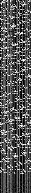

## Roblox Union MeshData

Here's the story:
1. See AssetId property of UnionOperation
2. Download [the asset](meshdata/385416572.rbxm)
3. Notice that it's in roblox binary format
4. Decode it and inspect the contents.
5. Contains an Instance with 'ChildData' and 'MeshData' properties
6. ChildData recursively contains more binary files as seen in [meshdata](meshdata)
7. MeshData remains mysterious

#### Interesting files
- Raw [meshdata](meshdata/385416572.meshdata)
- Comma separated list of bytes [meshdata.txt](meshdata/meshdata.txt)
- Image [meshdata.png](meshdata/meshdata.png)
